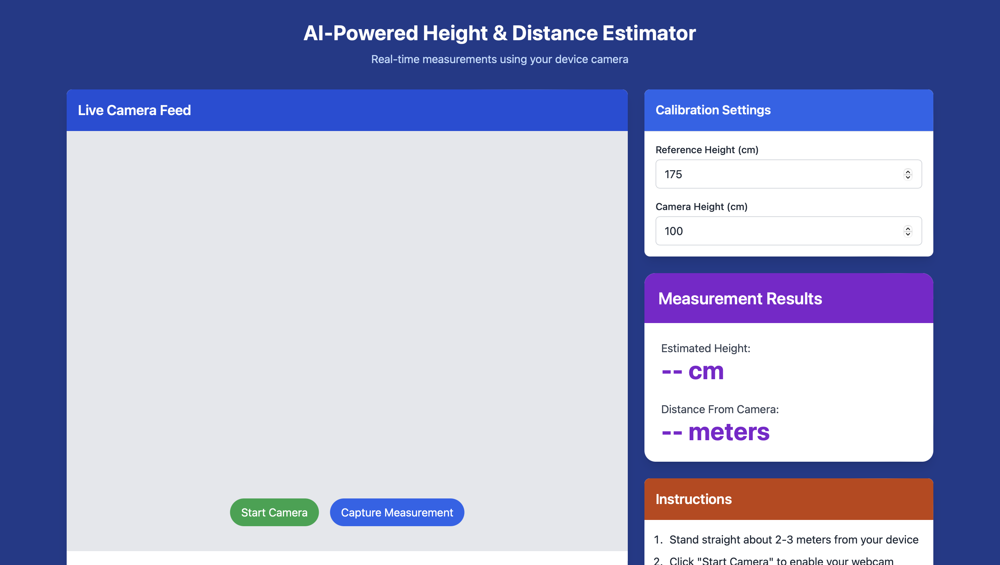
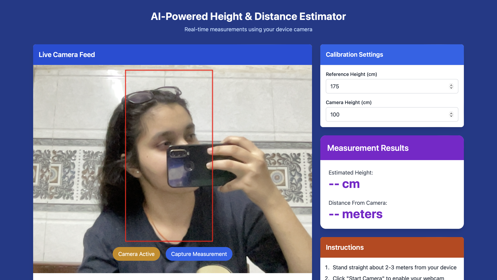
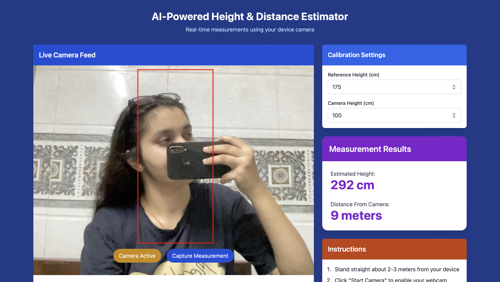

# 📏 AI-Powered Height & Distance Estimator

An intelligent web-based tool to estimate the **height** and **distance** of a person or object in real-time using your device camera and computer vision.

## 🚀 Features

- 🎥 Live webcam feed with AI estimation
- 📐 Real-time height and distance detection
- 🧠 Calibrate using camera & reference height
- 📦 Clean UI with Tailwind CSS
- ✅ Red bounding box around detected object

---

## 📸 Screenshot

> ⚠️ Replace these with your own screenshots in the `screenshots/` folder

| Live Feed | Results Panel |
|----------|---------------|
|  |  |

---

## 🛠️ Tech Stack

- HTML + CSS (Tailwind)
- JavaScript (Front-end logic)
- TensorFlow.js / ONNX Runtime (AI inference)
- OpenCV.js / Canvas API (drawing overlays)

---

## 🧪 How It Works

1. User clicks **Start Camera**
2. The camera starts capturing the live video feed
3. AI detects the object and measures:
   - Estimated Height
   - Distance from the camera
4. The app uses the **reference height** and **camera height** to calibrate

---

## ⚙️ Inputs

- **Reference Height**: Real-world known height of object/person (in cm)
- **Camera Height**: Height of the webcam from the ground (in cm)

These help in perspective correction and more accurate estimation.

---

## 📋 Instructions

1. Enter reference height and camera height
2. Stand 2–3 meters away from the camera
3. Click **Capture Measurement**
4. View estimated height and distance on the side panel

---

## 🌐 Live Demo (Optional)

> 🚧 Coming Soon via GitHub Pages or Vercel

---

## 🧑‍💻 Developed By

**Falak Yadav**  
🎓 AIML Student | 💡 Tech Innovator  
🔗 [LinkedIn](https://www.linkedin.com/in/falak-yadav-a61199241/) | 🧠 [Portfolio](https://rao11falakyadav.github.io/portfolio/)

---

## 📄 License

This project is open-source and available under the [MIT License](LICENSE).
